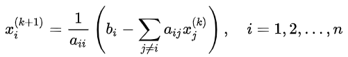

# Parallel Jacobi Method - Parallel and Distributed System Project 🎓

The Jacobi iterative method computes the result of a system of equations Ax = B (with x vector of the variable of length n, A matrix of coefficients of dimension n by n and vector of known terms of length n) iteratively computing a new approximation of the values of the different variables according to the formula:

starting from some initial assignment of each xi (e.g. 0).
The goal of this project is to implement the Jacobi method with both native C++ threads and FastFlow to fully understand the benefits of using parallel patterns. 
